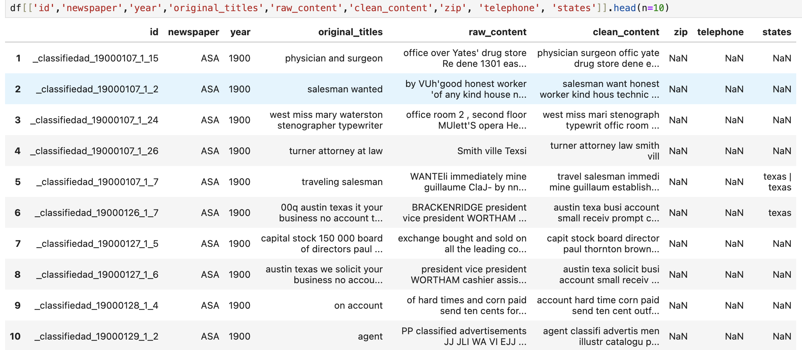
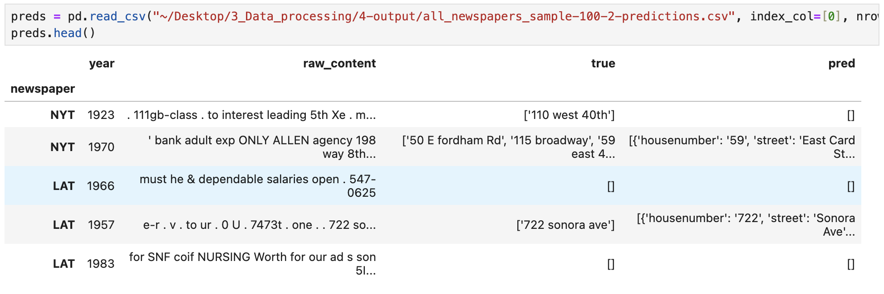
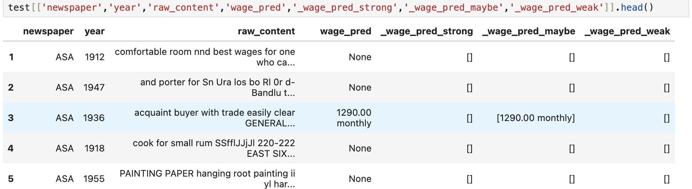
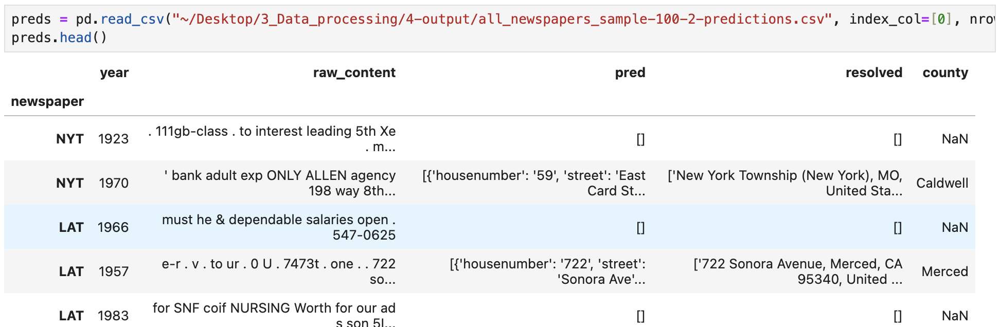
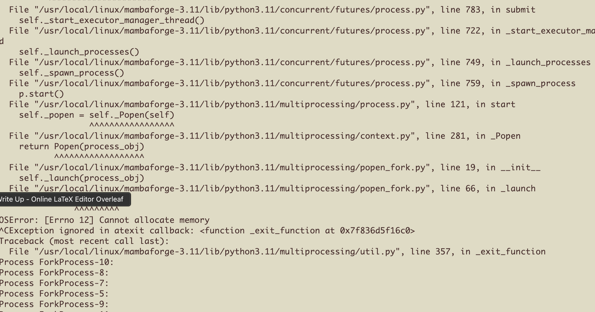

# newspaper-extract

## Newslabor data synthesis for *"The Origins of Racial Discrimination in US Labor Markets"* by Ellora Derononcourt, Joan Martinez, and Miguel Camacho Horvitz

Here we publish the extraction procedure for fields of interest from roughly 34 million vacancy (i.e. job advertisement listings) postings data. The results can be found directly on Berkeley's EML computer cluster at `~/Documents/Newspaper_2023/3_Data_processing/4-output/`, here we describe how to replicate those data.

The initial data look like  Contact Joan Martinez for original data access from ProQuest DFM. 

We extract features from thirteen newspapers using the following abbrevations: ASA, ATC, ATL, BaS, BoG, ChT, HaC, LAS, LAT, NJG, NYr, NYT, and WaP.

## Installation

To run locally, we advise you create a virtual environment so as to install necessary packages in a clean environment, guaranteed of no clashing dependencies.

```bash
 python3 -m venv venv
 source ./venv/bin/activate
```

Install packages with `pip`

```bash
 pip install -r requirements.txt
```


## App Structure ##

```
└── newspaper-extract/
    ├── README.md
    ├── batch.sh
    ├── scripts/
    ├──── common.py
    ├──── extract.py
    ├──── resolve.py
    ├──── merge-batch.py
    ├── test_data/
    ├──── NJG.csv
    ├── example_images/
    ├──── data.png
    ├──── ...
    ├── auxiliary_files/
    ├──── states.csv
    ├──── ...
```

###### extract.py ######

Extraction of features happens here.

###### resolve.py ######

Validation of addresses happens here.

###### common.py ######

Any commonly used functions/classes will sit here.


## Sample usage

### extract.py ###

Given a path to a newspaper's advertisements (e.g. `/test_data/NJG.csv` from the historical Norfolk Journal & Guide) corresponding to ad-level observations containing `raw_content` feature of ad text, we can run `scripts/extract.py` to *extract* geolocation candidates of text as follows.

`python scripts/extract.py --filepath=<PATH_TO_AD_CSV_FILE>  --aux_dir=<PATH_TO_AUXILIARY_DATA_FILES> --output_dir=<PATH_TO_OUTPUT_DIRECTORY>` 

Example run using `NJG.csv` located in `./test_data/`:
```bash
python scripts/extract.py --filepath=./test_data/NJG.csv  --aux_dir=./auxiliary_files --output_dir=./test_data
```

Example ouput written to e.g. `./test_data/NJG-extract-all.gzip`, containing all columns from `NJG.csv` plus an additional column `addresses` of objects that look like, e.g.
```
array([
{
	'housenumber': '509',
	'street': 'Main Street',
	'city': None,
	'county': None, 
	'state': 'Virginia',  
	'zipcode': None
},
{
	'housenumber': None,
	'street': None,
	'city': 'Norfolk', 
	'county': 'Norfolk',  
	'state': 'Virginia', 
	'zipcode': '23501'
}
], dtype=object)
```
as we see here below: 

Note that we could alternatively turn on the `extract_wage` flag:
`python scripts/extract.py --extract_wage=1 --filepath=<PATH_TO_AD_CSV_FILE>  --aux_dir=<PATH_TO_AUXILIARY_DATA_FILES> --output_dir=<PATH_TO_OUTPUT_DIRECTORY>`
in which case we would *additionally* extract a candidate wage (i.e. salary) from each job ad. In this case, `./outputs/NJG-extract-all.gzip`, will contain an additional `wage` feature of strings which look like, e.g. `$60 per hour` as we can see here: 

Then, given the *candidate* `addresses` we identified, we can *validate* and identify the *county* field from the validated addresses using a (business) geocoding API. In this code, we use [GeoApify](https://www.geoapify.com/geocoding-api)'s API as follows in the section below.

### resolve.py ###

Given a filepath to a dataset containing candidate `addresses`, we can validate said addresses calling
`python scripts/resolve.py --filepath=<FILEPATH_TO_ADDRESS_DATA_FILE> --aux_dir=<PATH_TO_AUXILIARY_DATA_FILES> --output_dir=<PATH_TO_OUTPUT_DIRECTORY>`

Or, again using the `NJG` example data:
```bash
python scripts/resolve.py --filepath=./test_data/NJG-extract-all.gzip  --aux_dir=./auxiliary_files --output_dir=./test_data
```

which will output the input dataset plus additional columns `geo_addrs`, `geo_county`, `geo_zip_county`, and `geo_requests` which records the full Geoapify response. Here below we show an example but with `geo_addrs` renamed `resolved` and `geo_county` renamed `county`: 

Note that the Geoapify response keys can be found and explained [here](https://apidocs.geoapify.com/docs/geocoding/).


### Additional Notes ###

###### Auxiliary Files ######

In the geo-location extraction we leverage several outside resources. Specifically, `auxiliary_files/countyzipcrosswalks.csv` allows us to map postal (zip) codes to US counties using [Pahontu (2020) dataverse](https://dataverse.harvard.edu/dataset.xhtml?persistentId=doi:10.7910/DVN/Z4YTA6). Additionally, `auxiliary_files/dictionary_list.txt` provides an English-language word-frequency dictionary used for spell corrections, `auxiliary_files/states.csv` provides US state names and their abbreviations thanks to [Jason Ong](https://github.com/jasonong/List-of-US-States/blob/master/states.csv), and `auxiliary_files/neighbor-states.csv` provides US states and their neighboring states thanks to [
Ubikuity](https://github.com/ubikuity/List-of-neighboring-states-for-each-US-state/blob/master/neighbors-states.csv). Finally, `auxiliary_files/simplemaps/uscities.csv` and `auxiliary_files/simplemaps/uszips.csv` provides US city and zip code data from [SimpleMaps](https://simplemaps.com/data/us-cities) with the license available at `auxiliary_files/simplemaps/license.txt`.

###### Concurrency ######

Note that in EML we can leverage additional resources and run concurrent code, especially when waiting on API requests. Then it is helpful to consider running multithreading.


###### Intermediate Files ######

Note that, given the long runtimes of the address validation (`resolve`) scripts, we save intermediate files (e.g. every 10,000 validated advertisement addresses) by default. To merge these batched, intermediate files and clean up (i.e. delete them after consolidation) you can run, for e.g. `NJG`
```bash
python scripts/merge-batch.py --filepath=./test_data/NJG-extract-all.gzip --batch_dir=./test_data/ --delete=1 --output_dir=./test_data/
```

###### Final Datasets ######

To make *final* dataset, i.e. those found in EML `/9-final/`, for a given newspaper we can run the following code from the directory containing the `geolocation` and `wage` output folders. 

In EML, for example, we first move to `~/4-output`, create the "final" data directory:

```bash
cd ~/Documents/Newspaper_2023/3_Data_processing/4-output
mkdir 9-final
```

Then synthesize the "final" data as follows:

```python
import pandas as pd
import numpy as np

def best_coordinates(response_list:np.ndarray) -> dict:
	""" First, we extract only the fields of interest from the Geoapify response data """
	coordinates = {'latitude':None, 'longitude':None, 'coordinates_confidence':None}
	best_confidence = -1
	# For response dict in list of candidate address resolutions
	for resp_dict in response_list:
		if resp_dict.get("status_code") != 200: continue
		# For validated address option
		for option in resp_dict['content']['features']:
			if option['properties']['rank']['confidence'] > best_confidence:
				coordinates['address'] = option['properties']['formatted']
				coordinates['county'] = option['properties']['county']
				coordinates['postcode'] = option['properties']['postcode']
				coordinates['latitude'] = option['properties']['lat']
				coordinates['longitude'] = option['properties']['lon']
				coordinates['coordinates_confidence'] = option['properties']['rank']['confidence']
				best_confidence = option['properties']['rank']['confidence']
	return coordinates

def merge_final(newspaper:str):
	# Get geolocation data (here a minimal version with a `geo_requests` field containing
	# the full Geoapify response objects)
	geo = pd.read_parquet(f"./7-geolocation/{newspaper}-request-minimal.gzip")
	coordinates = geo.apply(lambda row: best_coordinates(row.geo_requests), 
		axis='columns', result_type='expand')
	coordinates['id'] = geo['id']
	del geo 

	# Merge fields of geolocation interest with original data 
	df = pd.read_csv(f"./6-final-datasets/{newspaper}.csv", index_col=[0]
	).merge(coordinates, on='id', how='left')
	assert len(df) == len(coordinates)
	del coordinates

	# Merge extracted wages
	final = pd.read_parquet(f"./8-employer/{newspaper}-extract-all.gzip", 
		columns=['id','wage']
	).merge(df, on='id', how='left')
	assert len(final) == len(df)
	del df 

	# Write to 'final' files
	df.to_parquet(f"./9-final/{newspaper}.gzip", compression='gzip')
	df.to_csv(f"./9-final/{newspaper}.csv")

```


###### Final Statistics ######

And to recover geo-location statistics about our data:

```python
import pandas as pd
import os
import numpy as np

for file in os.listdir():
	if not file.endswith("resolve-all.gzip"): continue
	print("On file '{}'".format(file))
	df = pd.read_parquet("./{}".format(file))
	# Consolidate direct county output and zip-to-county output
	df['counties'] = pd.Series(np.where(df.geo_county.isna(), df.geo_zip_county, df.geo_county))	
	candidate_addrs = df.addresses.str.len()
	print("Candidate addresses:", sum(candidate_addrs))
	print("Ads with candidate:", sum(candidate_addrs > 0))
	resolved = df.geo_addrs.apply(lambda x: sum(~pd.isnull(x)))
	not_resolved = sum(df.geo_addrs.apply(lambda x: sum(pd.isnull(x))))
	assert sum(resolved) + not_resolved == sum(candidate_addrs)
	print("Resolved addresses:", sum(resolved))
	print("Ads with resolved address:", sum(resolved > 0))
	print("Share of resolved addresses:", round(sum(resolved) / sum(candidate_addrs), 2))
	print("Share of ads with resolved address:", round(sum(resolved > 0) / sum(candidate_addrs > 0), 2))
	print("Ads with resolved county:", sum(df.geo_county.notna()))
	print("Ads with zip-to-county:", sum(df.geo_zip_county.notna()))
	print("Ads with *any* county:", sum(df.counties.notna()))
	print("Share of ads with county from resolved addresses:", 
			round(sum(df.counties.notna()) / sum(resolved > 0), 2))
	del(df)

```


## Issues

- **Loading large CSV files:** When load data, e.g. `df = pd.read_csv(filepath)`, get warning message (see below). 
	- We should look into those columns. Do we see speed-up if specify dtypes?
```
extract.py:114:DtypeWarning:Columns (19,20,21,22) have mixed types. Specify type option on import or set low_memory=False.
```

- **Multi-processing:** When trying to `extract` using multi-processing in EML cluster get memory allocation error: 
    - Should talk to Rowilma if becomes necessary.

